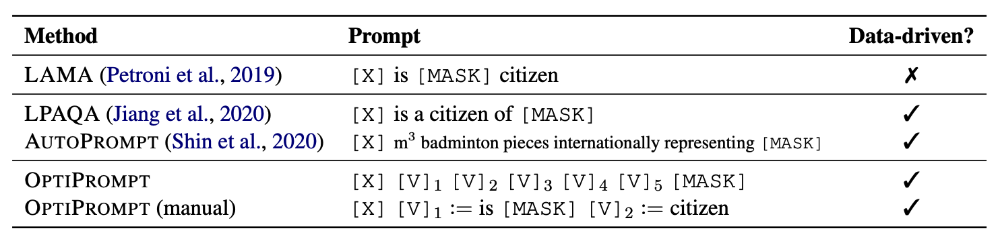

# OptiPrompt

This is the PyTorch implementation of the paper [Factual Probing Is [MASK]: Learning vs. Learning to Recall](https://arxiv.org/pdf/2104.05240.pdf).

We propose OptiPrompt, a simple and effective approach for Factual Probing. OptiPrompt optimizes the prompts on the input embedding space directly. It outperforms previous prompting methods on the LAMA benchmark.
Furthermore, in order to better interpret probing results, we propose control experiments based on the probing results on randomly initialized models.
Please check [our paper](https://arxiv.org/pdf/2104.05240.pdf) for details.



## Quick links
* [Setup](#Setup)
  * [Install dependencies](#Install-dependencies)
  * [Download the data](#Download-the-data)
* [Run OptiPrompt](#Run-optiprompt)
  * [Train/evaluate OptiPrompt](#Train/evaluate-optiPrompt)
  * [Run experiments on all relations](#Run-experiments-on-all-relations)
* [Run Fine-tuning](#Run-fine-tuning)
* [Evaluate LAMA/LPAQA/AutoPrompt prompts](#Evaluate-lamalpaqaautoprompt-prompts)
* [Questions?](#questions)
* [Citation](#Citation)

## Setup

### Install dependecies
Our code is based on python 3.7. All experiments are run on a single GPU.

Please install all the dependency packages using the following command:
```bash
pip install -r requirements.txt
```

### Download the data
We pack all datasets we used in our experiments [here](https://nlp.cs.princeton.edu/projects/optiprompt/data.tar.gz). Please download it and extract the files to `./data`, or run the following commands to autoamtically download and extract it.
```bash
bash scripts/download_data.sh
```

The datasets are structured as below.

    data
    ├── LAMA-TREx                         # The original LAMA-TREx test set (34,039 examples)
    │   ├── P17.jsonl                     # Testing file for the relation `P17`
    │   └── ...
    ├── LAMA-TREx_UHN                     # The LAMA-TREx_UHN test set (27,102 examples)
    │   ├── P17.jsonl                     # Testing file for the relation `P17`
    │   └── ...
    ├── LAMA-TREx-easy-hard               # The easy and hard partitions of the LAMA-TREx dataset (check the paper for details)
    │   ├── Easy                          # The LAMA-easy partition (10,546 examples)
    │   │   ├── P17.jsonl                 # Testing file for the relation `P17`
    │   │   └── ...
    │   └── Hard                          # The LAMA-hard partition (23,493 examples)
    │       ├── P17.jsonl                 # Testing file for the relation `P17`
    │       └── ...
    ├── autoprompt_data                   # Training data collected by AutoPrompt
    │   ├── P17                           # Train/dev/test files for the relation `P17`
    │   │   ├── train.jsonl               # Training examples
    │   │   ├── dev.jsonl                 # Development examples
    │   │   └── test.jsonl                # Test examples (the same as LAMA-TREx test set)
    │   └── ...
    └── cmp_lms_data                      # Training data collected by ourselves which can be used for BERT, RoBERTa, and ALBERT (we only use this dataset in Table 6 in the paper)
        ├── P17                           # Train/dev/test files for the relation `P17`
        │   ├── train.jsonl               # Training examples
        │   ├── dev.jsonl                 # Development examples
        │   ├── test.jsonl                # Test examples (a subset of the LAMA-TREx test set, filtered using the common vocab of three models)
        └── ...

## Run OptiPrompt

### Train/evaluate OptiPrompt
You can use `code/run_optiprompt.py` to train or evaluate the prompts on a specific relation. A command template is as follow:
```bash
rel=P101
dir=outputs/${rel}
mkdir -p ${dir}

python code/run_optiprompt.py \
    --relation_profile relation_metainfo/LAMA_relations.jsonl \
    --relation ${rel} \
    --common_vocab_filename common_vocabs/common_vocab_cased.txt \
    --model_name bert-base-cased \
    --do_train \
    --train_data data/autoprompt_data/${rel}/train.jsonl \
    --dev_data data/autoprompt_data/${rel}/dev.jsonl \
    --do_eval \
    --test_data data/LAMA-TREx/${rel}.jsonl \
    --output_dir ${dir} \
    --random_init none \
    --output_predictions \
    [--init_manual_template] [--num_vectors 5 | 10]
```
Arguments:

* `relation_profile`: the meta information for each relation, containing the manual templates.
* `relation`: the relation type (e.g., `P101`) considered in this experiment.
* `common_vocab_filename`: the vocabulary used to filter out facts; it should be the intersection of different models' for fair comparison.
* `model_name`: the pre-trained model used in this experiment, e.g., `bert-base-cased`, `albert-xxlarge-v1`.
* `do_train`: whether to train the prompts on a training and development set.
* `do_eval`: whether to test the trained prompts on a testing set.
* `{train|dev|test}_data`: the file path of training/development/testing dataset.
* `random_init`: how do we random initialize the model before training, there are three settings:
    * `none`: use the pre-trained model, no random initialization is used;
    * `embedding`: the `Rand E` control setting, where we random initialize the embedding layer of the model;
    * `all`: the `Rand M` control setting, where we random initialize all the parameters of the model.
* `init_manual_template`: whether initialize the dense vectors in OptiPrompt using the manual prompts.
* `num_vectors`: how many dense vectors are added in OptiPrompt (this argument is valid only when `init_manual_template` is **not** set).
* `output_predictions`: whether to output top-k predictions for each testing fact (`k` is specified by `--k`).

### Run experiments on all relations

We provide an example script (`scripts/run_optiprompt.sh`) to run OptiPrompt on all 41 relations on the LAMA benchmark. Run the following command to use it:

```bash
bash scripts/run_opti.sh
```

The default setting of this script is to run OptiPromot initialized with manual prompts on the pre-trained `bert-base-cased` model (no random initialization is used). The results will be stored in the `outputs` directory.

Please modify the shell variables (i.e., `OUTPUTS_DIR`, `MODEL`, `RAND`) in `scripts/run_optiprompt.sh` if you want to run experiments on other settings.

## Run Fine-tuning

We release the code that we used in our experiments (check Section 4 in the paper).

### Fine-tuning language models on factual probing
You can use `code/run_finetune.py` to fine-tune a language model on a specific relation. A command template is as follow:

```bash
rel=P101
dir=outputs/${rel}
mkdir -p ${dir}

python code/run_finetune.py \
    --relation_profile relation_metainfo/LAMA_relations.jsonl \
    --relation ${rel} \
    --common_vocab_filename common_vocabs/common_vocab_cased.txt \
    --model_name bert-base-cased \
    --do_train \
    --train_data data/autoprompt_data/${rel}/train.jsonl \
    --dev_data data/autoprompt_data/${rel}/dev.jsonl \
    --do_eval \
    --test_data data/LAMA-TREx/${rel}.jsonl \
    --output_dir ${dir} \
    --random_init none \
    --output_predictions
```

Arguments:
* `relation_profile`: the meta information for each relation, containing the manual templates.
* `relation`: the relation type (e.g., `P101`) considered in this experiment.
* `common_vocab_filename`: the vocabulary used to filter out facts; it should be the intersection of different models' for fair comparison.
* `model_name`: the pre-trained model used in this experiment, e.g., `bert-base-cased`, `albert-xxlarge-v1`.
* `do_train`: whether to train the prompts on a training and development set.
* `do_eval`: whether to test the trained prompts on a testing set.
* `{train|dev|test}_data`: the file path of training/development/testing dataset.
* `random_init`: how do we random initialize the model before training, there are three settings:
    * `none`: use the pre-trained model, no random initialization is used;
    * `embedding`: the `Rand E` control setting, where we random initialize the embedding layer of the model;
    * `all`: the `Rand M` control setting, where we random initialize all the parameters of the model.
* `output_predictions`: whether to output top-k predictions for each testing fact (`k` is specified by `--k`).

### Run experiments on all relations
We provide an example script (`scripts/run_finetune.sh`) to run fine-tuning on all 41 relations on the LAMA benchmark. Run the following command to use it:

```bash
bash scripts/run_finetune.sh
```

Please modify the shell variables (i.e., `OUTPUTS_DIR`, `MODEL`, `RAND`) in `scripts/run_finetune.sh` if you want to run experiments on other settings.

## Evaluate LAMA/LPAQA/AutoPrompt prompts
We provide a script to evaluate prompts released in previous works (based on `code/run_finetune.py` with only `--do_eval`). Please use the foolowing command:

```bash
bash scripts/run_eval_prompts {lama | lpaqa | autoprompt}
```

## Questions?
If you have any questions related to the code or the paper, feel free to email Zexuan Zhong `(zzhong@cs.princeton.edu)` or Dan Friedman `(dfriedman@cs.princeton.edu)`. If you encounter any problems when using the code, or want to report a bug, you can open an issue. Please try to specify the problem with details so we can help you better and quicker!

## Citation
If you use our code in your research, please cite our work:
```bibtex
@inproceedings{zhong2021factual,
   title={Factual Probing Is [MASK]: Learning vs. Learning to Recall},
   author={Zhong, Zexuan and Friedman, Dan and Chen, Danqi},
   booktitle={North American Association for Computational Linguistics (NAACL)},
   year={2021}
}
```
